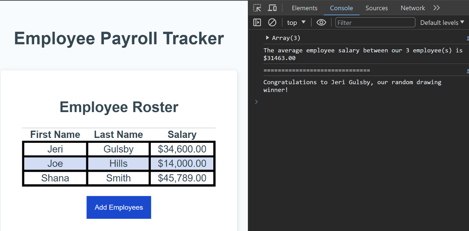

# Payroll App

## Description

A learning opportunity to enhance an existing code base to have functioning java script which covers the following acceptance criteria:

- WHEN I click the "Add employee" button
  THEN I am presented with a series of prompts asking for first name, last name, and salary
- WHEN I finish adding an employee
  THEN I am prompted to continue or cancel
- WHEN I choose to continue
  THEN I am prompted to add a new employee
- WHEN I choose to cancel
  THEN my employee data is displayed on the page sorted alphabetically by last name, and the console shows computed and aggregated data

## Table of Contents

- [Installation](#installation)
- [Usage](#usage)
- [Credits](#credits)
- [License](#license)

## Installation

You may clone the repository for access to the project files directly to copy/paste as needed. You may also fork the repository to utilize git actions to deploy as needed to support your workflows.

Since this is a static code project it may be deployed on any hosting platform supporting static code projects supporting html, css, and javascript including cloud providers:

- [AWS](https://aws.amazon.com/getting-started/hands-on/host-static-website/)
- [Azure](https://learn.microsoft.com/en-us/azure/static-web-apps/getting-started?tabs=vanilla-javascript)
- [Google Cloud](https://cloud.google.com/storage/docs/hosting-static-website)

Additionally, if your preference is more hands-on, you can deploy manually to:

- [IIS](https://learn.microsoft.com/en-us/iis/manage/creating-websites/scenario-build-a-static-website-on-iis)
- [Apache Tomcat](https://tomcat.apache.org/tomcat-9.0-doc/appdev/deployment.html)
- [Apache Http](https://fullstackdeveloper.guru/2021/04/08/how-to-deploy-html-javascript-code-to-apache-http-server/)

## Usage

This web project is currently deployed [on Github Pages](https://ericroys-school.github.io/payroll/)

The outcome of the project is to deliver a webpage that looks like the mock-up (see below) and meets all the acceptance criterion through the use of java script.

The screen shot provided shows the populated table for the application after a user has added employees, on the left. On the right is the console output displaying the average salary calculated for all the employees entered as well as a random selection from the entered employees into a drawing.

## Credits

I would like to thank my kittens for the timely distractions to support proper posture and work-life balance.

## License

This project is licensed with the "Unlicense" license. [(Read more here)](LICENSE)

## How to Contribute

Thank you, but we are not seeking any contributions at this time.

## Tests

The project was unit tested while being developed. Automated testing will be added in future projects.
